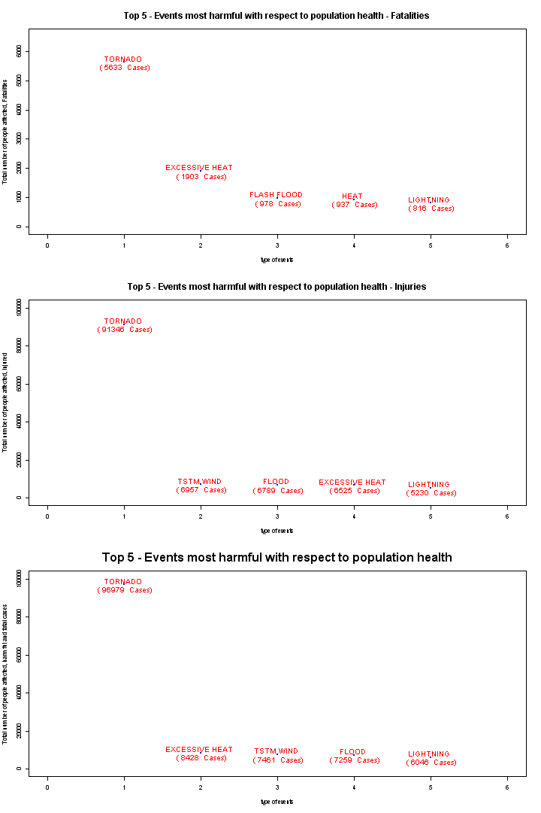
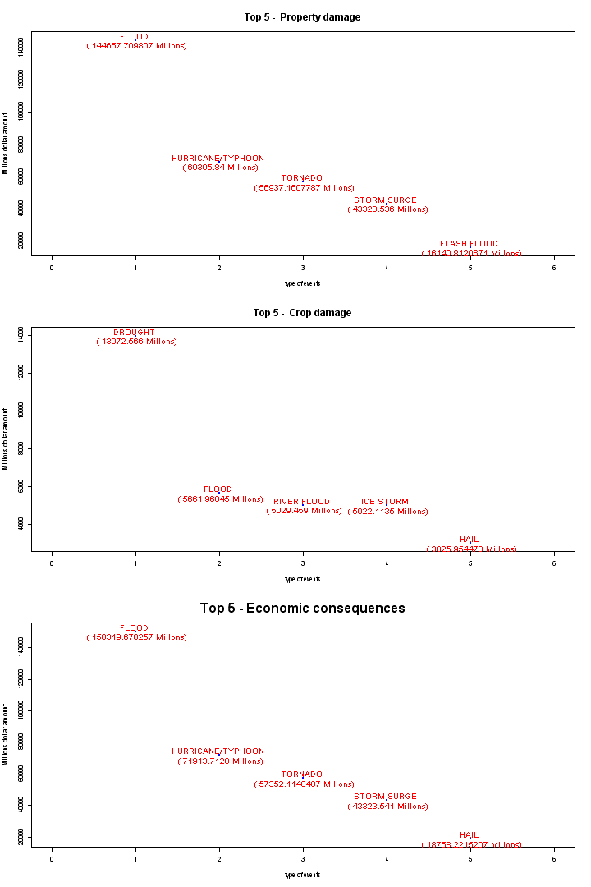

Climatic Events and their Impact on Public Health and Economy
========================================================

### Synopsis:

We analyzed the database of the U.S. National Oceanic and Atmospheric Administration 's ( NOAA ) events to determine which produces the highest impact in terms of damage to health and economic costs of these are in the population.

Data processing was performed to conduct a proper analysis later events were identified and quantified to identify which of these were more harmful because of the number of injuries and deaths and the total economic loss was recorded for each event .

The two parameters are chosen to determine the damage to public health and damage and economic costs generated by the observed phenomena.

Achievement is determined that the two main events that cause more damage to public health are Tornadoes , followed by excessive heat , While economic costs two more losses generated events are floods and hurricanes. Also shown in this report for each of these analyzes graphs where you can see the Top 5 of each of the events and their consequences and impact.


# Data Processing

Initial data are processed in this part all the cleaning and setting complete database is made and leads to a simplified data base, which contains only the variables that were used in the report. 


```r
options(rpubs.upload.method = "internal")
data <- read.table("C:/Documents and Settings/cherrera/Escritorio/Peer Research/repdata-data-StormData.csv.bz2", 
    header = TRUE, sep = ",")
levels(data$PROPDMGEXP) <- c("1", "1", "1", "1", "1", "1", "1", "1", "1", "1", 
    "1", "1", "1", "1000000000", "1", "1", "1000", "1000000", "1000000")
levels(data$CROPDMGEXP) <- c("1", "1", "1", "1", "1000000000", "1000", "1000", 
    "1000000", "1000000")
data$PROPDMG <- as.integer(as.character(data$PROPDMGEXP)) * data$PROPDMG
data$CROPDMG <- as.integer(as.character(data$CROPDMGEXP)) * data$CROPDMG
data <- data[, c(8, 23:25, 27)]
write.csv(data, "salida.csv")
```


Read data previously processed (this makes the process faster)


```r
setwd("~/")
data <- read.csv("salida.csv")
```


# Results 

see the analysis performed on the data previously processed and graphically see an answer to questions such as climatic know which events are more harmful to public health and which are more costly financially speaking.

## Part 1

## Most adverse events regarding the health of the population

This part would observe what type of more dangerous to people's health event, according to NOAA records.

We have two types of causes to consider injuries and fatalities in each event.

#### Injuries

```r
Injuries <- rep(data$EVTYPE, data$INJURIES)
Injuries <- data.frame(table(Injuries))
Injuries <- Injuries[order(Injuries$Freq, decreasing = TRUE), ][1:5, ]
names(Injuries) <- c("Injuries", "Freq")
row.names(Injuries) <- NULL
print(Injuries[1:5, ])
```

```
##         Injuries  Freq
## 1        TORNADO 91346
## 2      TSTM WIND  6957
## 3          FLOOD  6789
## 4 EXCESSIVE HEAT  6525
## 5      LIGHTNING  5230
```

#### Fatalities cases

```r
Fatalities <- rep(data$EVTYPE, data$FATALITIES)
Fatalities <- data.frame(table(Fatalities))
Fatalities <- Fatalities[order(Fatalities$Freq, decreasing = TRUE), ][1:5, ]
names(Fatalities) <- c("Fatalities", "Freq")
row.names(Fatalities) <- NULL
print(Fatalities[1:5, ])
```

```
##       Fatalities Freq
## 1        TORNADO 5633
## 2 EXCESSIVE HEAT 1903
## 3    FLASH FLOOD  978
## 4           HEAT  937
## 5      LIGHTNING  816
```


Finally we see the union between fatalities and injuries, and this total would be considered to rank which are the most harmful to the health of the population events.

#### Events More Harmful to population health

```r
Event <- as.factor(c(as.character(rep(data$EVTYPE, data$INJURIES)), as.character(rep(data$EVTYPE, 
    data$FATALITIES))))
Events <- data.frame(table(Event))
Events <- Events[order(Events$Freq, decreasing = TRUE), ][1:5, ]
names(Events) <- c("Event", "Freq")
row.names(Events) <- NULL
print(Events[1:5, ])
```

```
##            Event  Freq
## 1        TORNADO 96979
## 2 EXCESSIVE HEAT  8428
## 3      TSTM WIND  7461
## 4          FLOOD  7259
## 5      LIGHTNING  6046
```


Here we see graphically according to a top 5 of the most damaging events in terms of the health of the population.

#### Explanatory Graph

```r
par(mfrow = c(3, 1))
options(scipen = 10)
plot(1:length(Fatalities$Freq), Fatalities$Freq, col = "blue", main = "Top 5 - Events most harmful with respect to population health - Fatalities", 
    xlab = "type of events", ylab = "Total number of people affected, Fatalities", 
    xlim = c(0, 6), ylim = c(0, 6500), pch = 20, cex.main = 1.5)
text(1:length(Fatalities$Freq), Fatalities$Freq, paste(Fatalities$Fatalities, 
    "\n (", Fatalities$Freq, " Cases)"), cex = 1.2, col = c("red"))
options(scipen = 10)
plot(1:length(Injuries$Freq), Injuries$Freq, col = "blue", main = "Top 5 - Events most harmful with respect to population health - Injuries", 
    xlab = "type of events", ylab = "Total number of people affected, Injured", 
    xlim = c(0, 6), ylim = c(0, 100100), pch = 20, cex.main = 1.5)
text(1:length(Injuries$Freq), Injuries$Freq, paste(Injuries$Injuries, "\n (", 
    Injuries$Freq, " Cases)"), cex = 1.2, col = c("red"))
options(scipen = 10)
plot(1:length(Events$Freq), Events$Freq, col = "blue", main = "Top 5 - Events most harmful with respect to population health", 
    xlab = "type of events", ylab = "Total number of people affected, harmful and fatal cases", 
    xlim = c(0, 6), ylim = c(0, 100100), pch = 20, cex.main = 2)
text(1:length(Events$Freq), Events$Freq, paste(Events$Event, "\n (", Events$Freq, 
    " Cases)"), cex = 1.2, col = c("red"))
```

 


## Part 2

In this second part we will see, what are the events with more elevated economic consequences along EEUU, caused by climatic events recorded by NOAA.

## Types of events have the greatest economic consequences

Events that have larger economic consequences throughout EEUU.

#### amount Property damage

```r
PROPDMG <- tapply(data$PROPDMG, data$EVTYPE, sum)
PROPDMG <- PROPDMG[order(PROPDMG, decreasing = T)][1:5]
a <- data.frame(cbind(PROPDMG))
names(a) <- "dollars amount"
print(a)
```

```
##                   dollars amount
## FLOOD               144657709807
## HURRICANE/TYPHOON    69305840000
## TORNADO              56937160779
## STORM SURGE          43323536000
## FLASH FLOOD          16140812067
```


#### amount Crop damage

```r
CROPDMG <- tapply(data$CROPDMG, data$EVTYPE, sum)
CROPDMG <- CROPDMG[order(CROPDMG, decreasing = T)][1:5]
b <- data.frame(cbind(CROPDMG))
names(b) <- "dollars amount"
print(b)
```

```
##             dollars amount
## DROUGHT        13972566000
## FLOOD           5661968450
## RIVER FLOOD     5029459000
## ICE STORM       5022113500
## HAIL            3025954473
```


#### Economic consequences

```r
data$Econom <- data$PROPDMG + data$CROPDMG
DMG <- tapply(data$Econom, data$EVTYPE, sum)
DMG <- DMG[order(DMG, decreasing = T)][1:5]
d <- data.frame(cbind(DMG))
names(d) <- "dollars amount"
print(d)
```

```
##                   dollars amount
## FLOOD               150319678257
## HURRICANE/TYPHOON    71913712800
## TORNADO              57352114049
## STORM SURGE          43323541000
## HAIL                 18758221521
```


#### Explanatory Graph

```r
par(mfrow = c(3, 1))
options(scipen = 10)
plot(1:length(PROPDMG), PROPDMG/1000000, col = "blue", main = "Top 5 -  Property damage", 
    pch = 20, cex.main = 1.5, xlab = "type of events", ylab = "Millions dollar amount", 
    xlim = c(0, 6))
text(1:length(PROPDMG), PROPDMG/1000000, paste(names(PROPDMG), "\n (", PROPDMG/1000000, 
    "Millons)"), cex = 1.2, col = c("red"))
options(scipen = 10)
plot(1:length(CROPDMG), CROPDMG/1000000, col = "blue", main = "Top 5 -  Crop damage", 
    pch = 20, cex.main = 1.5, xlab = "type of events", ylab = "Millions dollar amount", 
    xlim = c(0, 6))
text(1:length(CROPDMG), CROPDMG/1000000, paste(names(CROPDMG), "\n (", CROPDMG/1000000, 
    "Millons)"), cex = 1.2, col = c("red"))
options(scipen = 10)
plot(1:length(DMG), DMG/1000000, col = "blue", main = "Top 5 - Economic consequences", 
    pch = 20, cex.main = 2, xlab = "type of events", ylab = "Millions dollar amount", 
    xlim = c(0, 6))
text(1:length(DMG), DMG/1000000, paste(names(DMG), "\n (", DMG/1000000, "Millons)"), 
    cex = 1.2, col = c("red"))
```

 


Finally, using this pair of graphs we can see which are the most worrisome climatic events, to consider along EEUU, as these analyzes may be helpful to plan focused social plans to reduce the amount of harm to citizens caused by cliumaticos events, besides being a good guide to help evaluate policies after any of these events and also to foresee the potential costs associated with future events.
