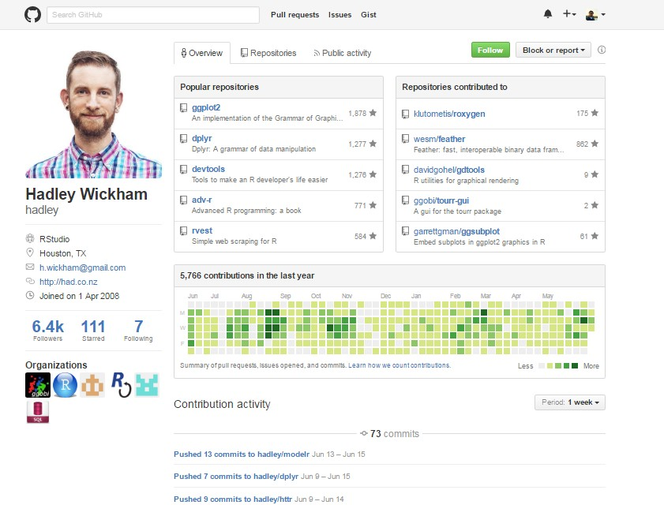
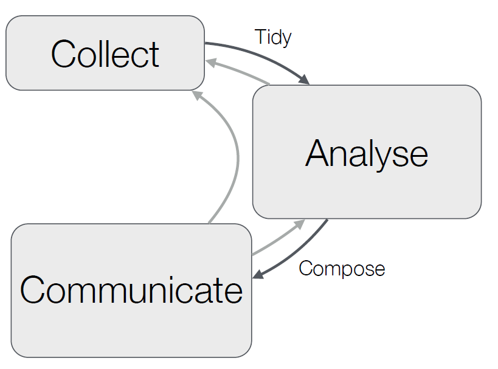

# Extracción y Generación de Conocimiento a través de los Datos

## <br>
<div class="centered">
```{r, out.height= 200, fig.retina = NULL ,echo=FALSE}


```

Estadístico - Universidad del Valle 

Sp. Data Science & Sp. Executive Data Science - Johns Hopkins Bloomberg

Msc candidate - Biometria  - Universidad de Buenos Aires

twitter: @hr_mr_zork     -    web: [http://camiloherrera.co/][1]  

Email: ch@camiloherrera.co
</div>

## Cronograma{.build}
 <br>

* Apertura del Evento

* Socialización R-Users MeetUp

* Sesión Introductoria Data Science con R

* Conferencias MeetUp: 

    + Cleaning Data and Merging Data Sources with R -> Daniel Valencia
    
    + Visualizando datos con ggplot -> Maria Isabel Arce
    
* Taller en R (Hands-on)

* Cierre

__Usa el Hashtag en twitter #RUsersCali__

# Ciencia de Datos

## Que es Ciencia de Datos
La Ciencia de datos es un campo interdisciplinario que involucra los procesos y sistemas para extraer conocimiento o un mejor entendimiento de grandes volúmenes de datos.

<div class="centered">
```{r, out.height= 400, fig.retina = NULL ,echo=FALSE}

```
</div>


## <br>
<div class="centered">
![][9]
</div>


## El Científico de Datos
<div class="centered">
```{r, out.height= 500, fig.retina = NULL ,echo=FALSE}
knitr::include_graphics("imagenes/cientifico.jpg")
```
</div>


## Habilidades de un Científico de Datos
<div class="centered">
```{r, out.height= 500, fig.retina = NULL ,echo=FALSE}

```
</div>


## Una Ruta para ser Científico de Datos{.build}

<div class="centered">
```{r, out.height= 500, fig.retina = NULL ,echo=FALSE}
knitr::include_graphics("imagenes/RoadToDataScientist.png")
```
</div>

##  Equipos de Data Science{.build}

La ciencia de datos es un proceso que requiere un esfuerzo importante, por lo tanto se necesita de un grupo con un comportamiento equivalente a un equipo deportivo:

<div class="centered">
```{r, out.height= 400, fig.retina = TRUE ,echo=FALSE}

```
</div>


##  Equipos de Data Science{.build}

Un equipo de ciencia de datos está compuesto por:


1. Ingenieros de Datos
    + Arquitectura de Datos
    + Infraestructura de Datos
    
    
2. Data science
    + Limpieza de Datos
    + Análisis y Comunicación
    
    
3. Líder del Equipo de Datos

# R <br> Lenguaje de Programación

## ¿Por qué R?{.build}

* R Es gratis
* Cuenta con un amplio conjunto de paquetes
* Acceso a los datos
* Limpieza de datos
* Análisis
* Generacion de Reportes
* Tiene uno de los mejores entornos de desarrollo - Rstudio http://www.rstudio.com/
* Tiene un increíble ecosistema de desarrolladores
* Los paquetes son fáciles de instalar y "juegan muy bien juntos"

## ¿Por qué R?{.build}

<div class="centered">
![][7]

<br>
<br>

R es considerado la "lingua franca" de la ciencia de datos, por esta razón las empresas se están adaptando rápidamente a R para desarrollar sus programas y productos de "Data Science".

</div>

## Paquetes en R

<br>

[Paquetes R en CRAN][2]

Existen paquetes para todo!!
<br>
<div class="centered">
```{r, out.height= 120, fig.retina = NULL ,echo=FALSE}

```

```{r, out.height= 120, fig.retina = NULL ,echo=FALSE}

```
</div>

<br>
[Visualizador][15]

# Plataformas de Analítica y Bigdata que apuestan por R

## SQL
<div class="centered">
```{r, out.height= 450, fig.retina = NULL ,echo=FALSE}

```
</div>

## Azure
<div class="centered">
```{r, out.height= 450, fig.retina = NULL ,echo=FALSE}

```
</div>

## HP
<div class="centered">
```{r, out.height= 450, fig.retina = NULL ,echo=FALSE}

```
</div>

## Sofia2 - Indra
<div class="centered">
```{r, out.height= 450, fig.retina = NULL ,echo=FALSE}

```
</div>

# La Apuesta de las Industrias por __R__

## R Consortium 

<div class="centered">
```{r, out.height= 450, fig.retina = NULL ,echo=FALSE}

```
</div>

La misión explícita del  R Consortium es "avanzar en la promoción mundial y el apoyo para el lenguaje de código abierto R"


# Big Data 

## <br>

**Guía del Viajero Intergaláctico  <br> The Hitchhiker's Guide to the Galaxy**

Una de las Historias cuenta, que una raza de __seres hiperinteligentes pandimensionales__  construyeron una computadora llamada Pensamiento Profundo («Deep Thought») fabricada con el único objetivo de descifrar la respuesta definitiva.

*«el sentido de la vida, el universo y todo lo demás»* 

 <div class="centered">
```{r, out.height= 250, fig.retina = NULL ,echo=FALSE}
knitr::include_graphics("imagenes/Simp.gif")
```
</div>

## <br>

**Guía del Viajero Intergaláctico  <br> The Hitchhiker's Guide to the Galaxy**


Pensamiento Profundo se toma __siete millones y medio de años__ para dar esa respuesta, la cual, para pesar de muchos, resulta ser __42__ sin lugar a dudas.

 <div class="centered">
```{r, out.height= 150, fig.retina = NULL ,echo=FALSE}

```
</div>

Cuando la respuesta se revela como 42, __se ven forzados a construir una computadora aún más poderosa para calcular la «Pregunta máxima»__, pero sus planes nunca culminan...


## Big Data
 <div class="centered">
```{r, out.height= 500, fig.retina = NULL ,echo=FALSE}
knitr::include_graphics("imagenes/big-data.jpg")
```
</div>

## R y Big Data
<div class="centered">
![][4]
</div>


 
## Panorama del Big Data 2016
 <div class="centered">
```{r, out.height= 500, fig.retina = NULL ,echo=FALSE}
knitr::include_graphics("imagenes/Big-Data-Landscape.png")
```
</div>


<!-- ## tidy data -  -->

<!-- Qué son los datos tidy? -->

<!-- * son datos fácil de transformar, visualizar y modelar -->

<!-- * idea clave: organizar las variables de una manera coherente, siempre como columnas. -->

<!-- * le paquete tidyr proporciona herramientas útiles para el ordenado de datos desordenados.  las Tres caracteristicas más importantes son: recopilar gather(), difundir spread() y separado separate(). -->

<!-- * Google "de datos ordenada" para más detalles. -->


# Visualización y Productos de Datos

##D3.Js
 <div class="centered">
```{r, out.height= 400, fig.retina = NULL ,echo=FALSE}

```
</div>

## Visualización y Productos de Datos

###Generar nuestras propias visualizaciones.
<div class="centered">
![][12]
</div>

## Visualización y Productos de Datos
###Generar nuestras propias visualizaciones. 

* Gráficos varios dentro de Dashboards

* Gráficos de Redes (nodos)

* Get data y plot (Ejemplo MIO) 

* __Publica un Tweet con el hashtag: #RUsersCali__


* Gráficos y Social tracking (Partido)

* [Ejemplo Twitter][16]

* Ejemplo linet (Descargas eléctricas)

* Data Mining - "What if"


## Rstudio y el Hadleyverse

<div class="centered">
```{r, out.height= 400, fig.retina = NULL ,echo=FALSE}

```
</div>


## Rstudio y el Hadleyverse

<div class="centered">
```{r, out.height= 500, fig.retina = NULL ,echo=FALSE}

```
</div>


## Procesos con Datos
 <div class="centered">
```{r, out.height= 500, fig.retina = NULL ,echo=FALSE}

```
</div>


## Procesos con Datos
 <div class="centered">
```{r, out.height= 500, fig.retina = NULL ,echo=FALSE}

```
</div>

## Procesos con Datos
 <div class="centered">
```{r, out.height= 500, fig.retina = NULL ,echo=FALSE}

```
</div>

## Procesos con Datos
 <div class="centered">
```{r, out.height= 500, fig.retina = NULL ,echo=FALSE}

```
</div>


## dplyr
 <div class="centered">
```{r, out.height= 500, fig.retina = NULL ,echo=FALSE}

```
</div>

## | Pipe
 <div class="centered">
```{r, out.height= 500, fig.retina = NULL ,echo=FALSE}

```
</div>

## Apps Shiny
 <div class="centered">
```{r, out.height= 500, fig.retina = NULL ,echo=FALSE}

```
</div>

## Apps Shiny
 <div class="centered">
```{r, out.height= 500, fig.retina = NULL ,echo=FALSE}

```
</div>

## Investigación Reproducible
 <div class="centered">
```{r, out.height= 500, fig.retina = NULL ,echo=FALSE}

```
</div>

## Fin Sesión Introductoria
 <div class="centered">
```{r, out.height= 500, fig.retina = NULL ,echo=FALSE}

```
</div>


[1]: http://camiloherrera.co/ "http://camiloherrera.co/"
[3]: imagenes/skillset.jpg "skill"
[4]: imagenes/big.jpg "big"
[5]: imagenes/RoadToDataScientist.png "road"
[6]: imagenes/Rcons.jpg "rcons"
[7]: imagenes/Rlogo.png "rlogo"
[8]: imagenes/data.science.png "rds"
[9]: imagenes/datascienceprocess.png "rproc"
[10]: imagenes/type.gif "type"
[11]: imagenes/simp.gif "type"
[12]: imagenes/bird.gif "bird"
[2]: https://cran.r-project.org/web/packages/available_packages_by_name.html "Paquetes CRAN"
[15]: https://jjallaire.shinyapps.io/shiny-crandash/ "Visual"
[16]: http://52.37.19.133:3838/sample-apps/stream/ "Twitter"
