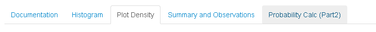
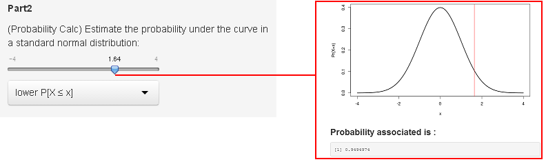

---
title       : Enjoy The New Shiny App
subtitle    : Generator of random numbers of normal distribution and probability calculator
author      : Shinyapps.io -> http://hrcamilo.shinyapps.io/HRFirstDevDatProd_Normal 
job         : GitHub -> https://github.com/mrzork/HRFirstDevDatProd_Normal/
framework   : io2012        # {io2012, html5slides, shower, dzslides, ...}
highlighter : highlight.js  # {highlight.js, prettify, highlight}
hitheme     : tomorrow      # 
widgets     : [mathjax]     # {mathjax, quiz, bootstrap}
mode        : standalone  # {standalone, draft}
knit        : slidify::knit2slides
---.class1 #id1
## Try our new app

With this app you can meet some of the characteristics related to a set of data which will generate yourself, These data have in the background a generated random number with normal distribution of which you define the parameters of $ \mu $  and  $ \sigma $, addition to controlling the amount of numbers to generate a data range defined in the app.

Density function of a normal distribution is:
$$f(x)=\frac{1}{\sigma\sqrt{2\pi}}\exp{}^{-\frac{1}{2}\left(\frac{x-\mu}{\sigma}\right)^{2}}$$

You can observe the behavior of these data as the average and standard deviation is varied additionally allows you to see graphically as distributed data generated from very few data to a large amount of data allowing to observe such as converges on average to as much samples giving support to the central limit theorem, among other interesting phenomena that we can observe.

### Modules in tabs

The app contains a series of tabs that allow you to see different features of the data generated from the documentation to summaries of the data generated, additionally the last module corresponds to our calculator probability associated with a standard normal distribution, which can be of help.


--- .class #id2
## Meet the functionality of our app
In __Part 1__: according to a set of data generated in a random manner and size you choose between 2 and 10000 random numbers with normal distribution with mean $ \mu $ and standard deviation  $ \sigma $, and 5000 random numbers by default, as shown below.
```{r fig.width=3,fig.height=3,fig.align='center'}
set.seed(1)
dist<-rnorm(5000,10,1)
hist(dist,main="Histogram of Random Points",50)
```
From this configuration you can move the slides to see how to achieve changes the structure of the data depending on the parameters, in addition to this you can see in the tab  __Plot Density__ something more than a histogram, you can see the fit of a plot of density according to data generated, including highlights and you'll see your data in the tab Summary and Observations.

--- .class #id3
## Other features of the app
On the tab __Probability Calc (Part2)__ you can find more features of this app.



How about calculating the probabilities associated with a given value in a standard normal distribution, although this slider allows you to make that calculation, in any sense, thanks to the button (lowerP[X ≤ x] - upperP[X > x]).

```{r}
 pnorm(1.64,0,1, lower.tail = T)
```

Here you can enjoy the app right here to guarantee you a test operation.
__enjoy it.__

---.class #id4
## Test the shiny app here.
<iframe src = 'http://hrcamilo.shinyapps.io/HRFirstDevDatProd_Normal/' height='1080px'></iframe>
### End

